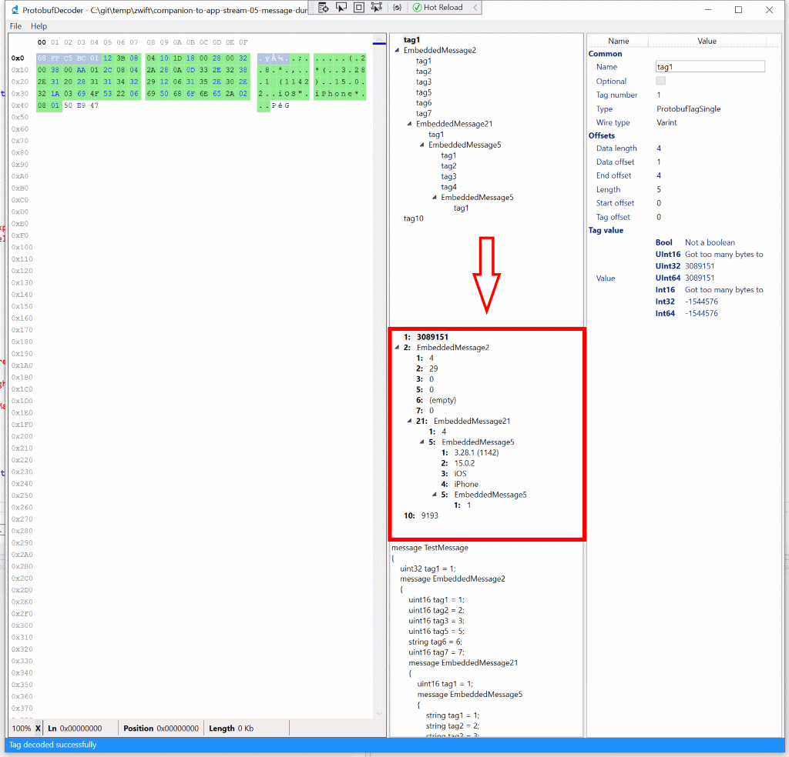

# Changelog

## 0.6.0

- The "Load from hex stream" dialog is now more accepting of input. You can now provide:
  - `010203`
  - `0x010203`
  - `0x01 0x02 0x03`
  - `\x01\x02\x03`
  - Multiple lines. Both `\n` and `\r\n` are suported as well as the multi-line escape character `\` when splitting text over multiple lines
  - Input with spaces: `0x01 0x02 0x03`
  - Any combination of the above
- Added the <kbd>Ctrl</kbd> + <kbd>Enter</kbd> shortcut key combination to the "Load from hex stream" to close the dialog and load the input.
- Added a new menu item to open a new ProtobufDecoder window. The shortcut key is <kbd>Ctrl</kbd> + <kbd>N</kbd>.
- You can now hit <kbd>Ctrl</kbd> + <kbd>C</kbd> when you select an item in the tag values tree view which will copy the value of the tag to the clipboard instead of the C# byte array.

### Fixes

- Icons are now properly set in the various dialog boxes.
- The <kbd>ESC</kbd> key now properly closes the "Load from hex stream" dialog.
- When canceling opening a file or loading from hex stream the status bar no longer shows "File loaded successfully".
- Dialogs now no longer appear in the task bar.

## 0.5.0

- Added an option to decode a hex-stream. You can now use the _Load from hex stream_ menu item (<kbd>Ctrl</kbd> + <kbd>Shift</kbd> + <kbd>H</kbd>) which opens a dialog box where you can enter a stream of hex encoded bytes to load. 
The format is a two characters per byte, for example `f200ba0d` for a 4 byte payload.
- Tags on the message root that can be decoded (embedded messages, repeated tags etc) will now be automatically decoded on load.
- Tags on the message root that have children will now automatically be expanded to improve usability as you don't have to manually expand those anymore.
- A new view has been added that shows the tag values in a tree view with the same structure as the tag structure tree view:

### Fixes

-  Fix issue where the trimmed length prefix bytes would still be visible in the hex-editor view which caused the selection highlighting to be off by 2 or 4 bytes.

## 0.4.0

- Added drag-and-drop support which means you can now drag a file onto the ProtobufDecoder window and it will load that file
- Added a _Decode all_ context menu option which is enabled on repeated and embedded message tags. When used it will attempt to decode all items (repeated tag) or tags (embedded message)
- Added a _Load from clipboard_ menu item which allows you to load raw bytes directly from the clipboard. You can use this together with the _Copy ...as raw binary_ option in Wireshark

### Fixes

- Fixed an issue where the current message tags and generated proto file would not be cleared when a new file is loaded and that fails. This would show stale data which wasn't very nice
- Fixed an issue where loading a file fails if it contains a length prefix. The status bar now indicates whether the length prefix was stripped and how many bytes (2 or 4)
- Fixed an issue where value detection was attempted on an empty tag, previously that caused a crash. It no longer does.

## 0.3.0

In this release contains the following:

- Improved Protobuf interface output particularly around nested messages
- Added detection of packed types such as varint and float. Packed doubles detection doesn't work yet and will be included in a future release
- Improved the wire type used in the Protobuf output for Varint types. It looks at the size of the value for now so [YMMV](http://www.catb.org/jargon/html/Y/YMMV.html), currently it will choose either `uint16`, `uint32` or `uint64`.
- Added detection of string values, this sometimes fails when a length-delimited tag has a value with tag numbers and values that fall in the ASCII printable characters range. Again, YMMV
- Fixes a bug where the _Decode tag_ context menu option would be enabled for tags that do not support further decoding
- The property grid now shows a description of the selected property which helps with figuring out the various values
- The property grid no longer shows the `Value` property for tag types that do not have a value
- The property grid now shows all the values of a packed tag
- The property grid now shows the possible types of a Varint value which should help you decide which actual type to use
- Under de hood a number of changes were made to make sure the tags tree view and Protobuf interface output are updated continuously
- The UI now has splitters between the tag tree view and the Protobuf output as well as in the property grid between the properties and the property description.

## 0.2.0

### New property grid

This release introduces a property grid that is a little nicer to look at. Booleans will now be proper check boxes and text and numbers will have get a text box.
When properties are editable the input controls in the property grid are now actually editable, for example the tag name.

To make this work properly, the models have been updated with the right attributes that drive the display in the property grid.

### Tag naming

You can now change the name of a tag. This helps greatly when you are analyzing a Protobuf payload and you want to see more than `tag1`, `tag2` etc. 
It's now possible to set them to any arbitrary value such as `foo`, `bar` or whatever suits your needs.

### Installer UI

The installer now shows more feedback of the installation process rather than having the plain MSI dialogs.
During installation the license is now also shown properly which was not the case before.