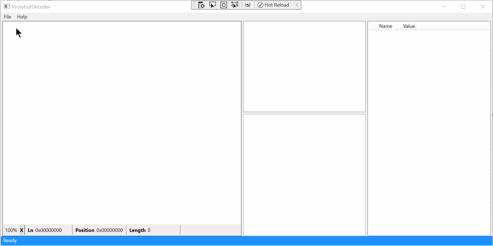

# ProtobufDecoder

This application helps with analyzing [Google Protocol Buffers](https://developers.google.com/protocol-buffers) payloads where you don't have a corresponding `.proto` file.

Scenarios where you might want to use this is to inspect the result of serialization or when you need to interoperate with a system talking Protobuf but which does not provide a `.proto` file. 
It can be used for _reverse engineering_ but bear in mind that this may not be legal in your jurisdiction.

## Features

- List fields in the captured payload and display information on:
  - Tag index
  - Wire type
  - Contents (raw bytes, values) 
- Display the location and size of a specific tag in the binary payload (select a tag in the tree view and it highlights the bytes)
- Generate a Protobuf spec from the decoded payload (work in progress)
- Save the generated Protobuf spec to a `.proto` file
- Copy the value of a tag as a C# byte array

## Building

Currently there is no packaged release of the application which means you will need to compile the application yourself.

1. Clone this repository
2. `cd` into the cloned directory
3. `cd src/ProtobufDecoder.Application.Wpf`
4. `dotnet run -c Release`

That will restore the necessary packages, build the application and start it.

To make running the application easier after step 3 run:

4. `dotnet publish -c Release`
5. Double-click the executable `ProtobufDecoder.Application.Wpf.exe` in the `src/ProtobufDecoder.Application.Wpf/bin/Release/net5.0-windows/publish` folder

You can create a shortcut to that executable in the Start Menu or wherever you wish.

## Usage

When the application starts, open a file that contains a Protobuf payload. 

Please note that at this time the ProtobufDecoder only supports the a file that contains _only_ a single raw Protobuf message. Any leading or trailing delimiters must be stripped before loading the file.

## Todo

- [X] ~~Decode length-delimited tag values that could be strings, packed repeated values or embedded messages~~
- [ ] Generate `.proto` file from decoded payload (work in progress)
- [ ] Package application for download
- [ ] Set up release build for git tags
- [ ] Load a `.proto` file and apply it to the decoded payload (to verify the `.proto` file and payload match)
- [ ] Decode groups

## License

See [LICENSE](./LICENSE).

## Achknowledgements

This application uses:

- [topas/VarintBitConverter/](https://github.com/topas/VarintBitConverter/) for Varint decoding from the Protobuf payloads. (See [VarintValue](./src/ProtobufDecoder/VarintValue.cs))
- [WPF:HexEditor](https://github.com/abbaye/WPFHexEditorControl) to display the raw payload and tag highlighting
